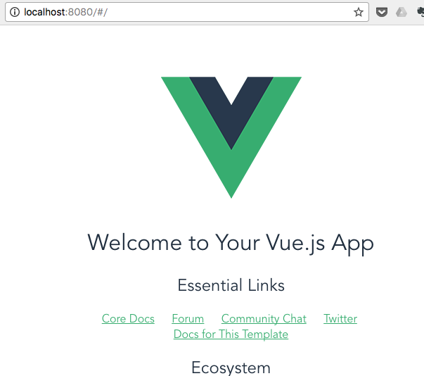
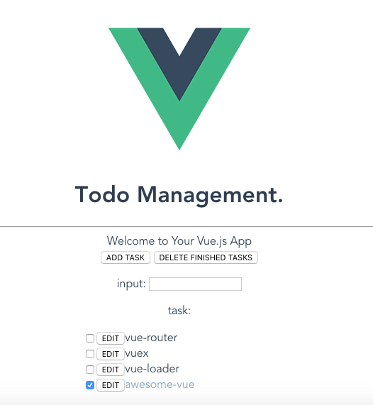
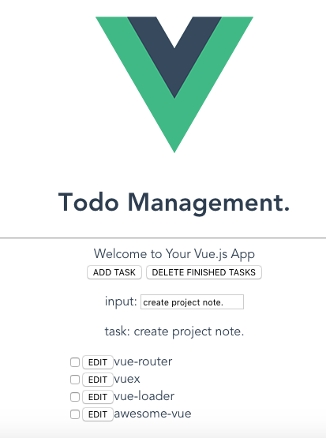
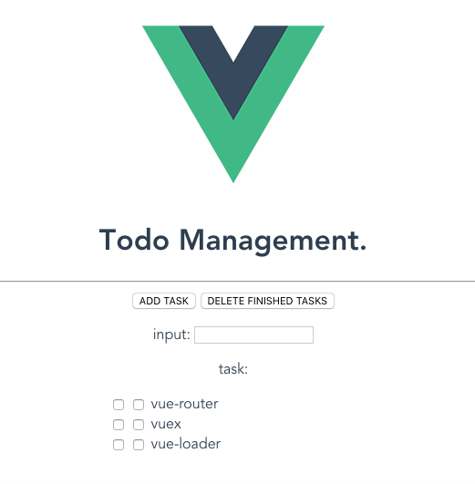
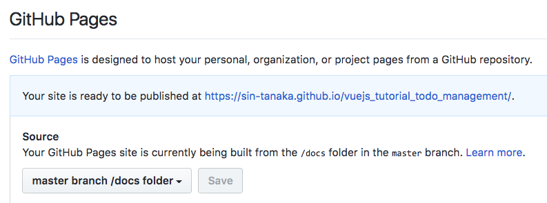

# tutorial_vuejs_todo_management

Vue.jsのtutorial用リポジトリ

## Build Setup

``` bash
# install dependencies
npm install

# serve with hot reload at localhost:8080
npm run dev

# build for production with minification
npm run build

# build for production and view the bundle analyzer report
npm run build --report

# run unit tests
npm run unit

# run all tests
npm test
```

F/or detailed explanation on how things work, checkout the [guide](http://vuejs-templates.GitHub.io/webpack/) and [docs for vue-loader](http://vuejs.GitHub.io/vue-loader).


## チュートリアルのゴール

* vue-cliをつかってプロジェクトを作成する
* Vue.jsでTodoリストアプリケーションを作ってみる
* 作成したアプリケーションをvue-loader、webpackでビルド／バンドルして、GitHub-pagesで配信してみる

### できたらやりたい

* コンポーネントに分割（親コンポーネント・子コンポーネント間でのデータのやり取り）
* Vuexの導入

リポジトリ: https://GitHub.com/sin-tanaka/vuejs_tutorial_todo_management  
GitHub-pages: https://sin-tanaka.GitHub.io/vuejs_tutorial_todo_management/

## 環境

```
% sw_vers
ProductName:    Mac OS X
ProductVersion: 10.11.6
BuildVersion:   15G1611

% node -v
v6.11.3

% npm -v
3.10.10

エディター: Pycharm # IntelliJ系のIDEであれば、Vue.js用のプラグインがあります
```

## Setup

まずはvue-cliをinstallします。
vue-cliは雛形からプロジェクトを作成してくれる公式ツールです。公式には、「nodeやnpm、webpackに詳しくないならあまり使わないほうがいいよ」と書いてあるのですがとても便利なので使います。

```console
% npm install -g vue-cli

% vue --version
2.8.2
```

`vue init <template> <project-name>` でプロジェクトを作成します。
ここではwebpackというテンプレートを使い、tutorial_vuejs_todo_managementというプロジェクト名にしています。

この時いくつか質問されます。私はLinterと単体テストとe2eテストのツールは外していますが、全てYesで良いと思います。
尚、公式ではESLintを使うことが推奨されています。しかし、jsコーディング規約に慣れていない人には結構つらいです。これを機会に慣れるのも有りだと思います。
Linterを使う人は、通常のLinterか、airbnbのLinterを選べますのでお好きな方を選びましょう。
ここでは初学者向けのチュートリアルということでLinterは外しています。

```console
% vue init webpack tutorial_vuejs_todo_management                                       

? Project name tutorial_vuejs_todo_management
? Project description A Vue.js project
? Author Shintaro Tanaka
? Vue build standalone
? Install vue-router? Yes
? Use ESLint to lint your code? No
? Setup unit tests with Karma + Mocha? No
? Setup e2e tests with Nightwatch? No

   vue-cli · Generated "tutorial_vuejs_todo_management".

   To get started:

     cd tutorial_vuejs_todo_management
     npm install
     npm run dev

   Documentation can be found at https://vuejs-templates.GitHub.io/webpack
```

`vue init` を実行したディレクトリにプロジェクトが作成されたので、`get started` の通りにコマンドを実行してみます。

```console
% cd tutorial_vuejs_todo_management
% npm install
% npm run dev
```

上手く行けば`localhost:8080` でブラウザが開いて以下の画面が表示されるはずです。



のちにGitHub-pagesを利用するため、GitHubを使いますので、この段階でGitHubリポジトリの作成、git init、pushまでしてしまうと楽だと思います。


主に編集していくファイルは以下になります。他はほとんど設定ファイルです。筆者も設定ファイルについてはあまりよく分かっていないのですが、それでも動くものが作れてしまうのがvue-cliを使う大きなメリットだと思います。

```console
# 一部省略
tutorial_vuejs_todo_management% tree
./index.html
./src
├── App.vue
├── assets
│   └── logo.png
├── components
│   └── Hello.vue
├── main.js
└── router
    └── index.js
```


一つずつザックリみて、全体の流れを把握してみます。

`index.html`
```html
<!DOCTYPE html>
<html>
  <head>
    <meta charset="utf-8">
    <title>tutorial_vuejs_todo_management</title>
  </head>
  <body>
    <div id="app"></div>
    <!-- built files will be auto injected -->
  </body>
</html>
```
これがルートのファイルっぽいですね。
cssもjsも読み込んでいませんが、最終的にはWebpackなどで一つのscriptファイルにバンドルされます。

`<div id="app"></div>` を覚えておいて下さい。

`src/main.js`
```js
// The Vue build version to load with the `import` command
// (runtime-only or standalone) has been set in webpack.base.conf with an alias.
import Vue from 'vue'
import App from './App'
import router from './router'

Vue.config.productionTip = false

/* eslint-disable no-new */
new Vue({
  el: '#app',
  router,
  template: '<App/>',
  components: { App }
})
```

ここではVueインスタンスを作成して、Appコンポーネントをindex.htmlのid=appの要素に紐付けています。
また、App、routerというモジュールを読み込んでいるようです。


`src/App.vue`
```vue
<template>
  <div id="app">
    
    <router-view></router-view>
  </div>
</template>

<script>
export default {
  name: 'app'
}
</script>

<style>
#app {
  font-family: 'Avenir', Helvetica, Arial, sans-serif;
  -webkit-font-smoothing: antialiased;
  -moz-osx-font-smoothing: grayscale;
  text-align: center;
  color: #2c3e50;
  margin-top: 60px;
}
</style>
```

先程読み込んでいたAppの実体です。`*.vue`という拡張子ですが、これはVueコンポーネントを記述するものです。
vue-loaderというモジュールでブラウザで読み込める形へコンパイルされます。
ここではAppコンポーネントを定義しています。
Helloコンポーネントの説明のときに詳しく説明しますので、ここではザックリ中身を見てみます。

<template>の中身を見ると、画面のVueのロゴはAppコンポーネントで出力しているようです。
又、`` タグ下の`<router-view>` というタグが気になりますね。

`src/router/index.js`
```js
import Vue from 'vue'
import Router from 'vue-router'
import Hello from '@/components/Hello'

Vue.use(Router)

export default new Router({
  routes: [
    {
      path: '/',
      name: 'Hello',
      component: Hello
    }
  ]
})
```
`<router-view>` の動作は`vue-router.Router` を読み込んだ`src/router/index.js`に定義されています。`vue-router` はルーティングと、それに対応して出力するコンポーネントを決めています。
ここでは`/` にアクセスした時、Helloコンポーネントを出力するように設定しています。ルーティングを追加するのは簡単で、routesの配列にオブジェクトを追加していくだけです。
ここではHogeコンポーネントがあると仮定し、`/hoge` にアクセスした時Hogeコンポーネントを返すルーティングを設定する例を示します。

`src/router/index.jsにルーティングを追加した例`
```js
export default new Router({
  routes: [
    {
      path: '/',
      name: 'Hello',
      component: Hello
    },
    {
      path: '/hoge',
      name: 'Hoge',
      component: Hoge
    }
  ]
})
```


`router/index.js` ではルートにアクセスしたとき、Helloコンポーネントを出力していることが分かりました。
Helloコンポーネントを見てみます。

`src/components/Hello.vue`
```vue
<template>
  <div class="hello">
    <h1>{{ msg }}</h1>
    <h2>Essential Links</h2>
    <ul>
      <li><a href="https://vuejs.org" target="_blank">Core Docs</a></li>
      <li><a href="https://forum.vuejs.org" target="_blank">Forum</a></li>
      <li><a href="https://chat.vuejs.org" target="_blank">Community Chat</a></li>
      <li><a href="https://twitter.com/vuejs" target="_blank">Twitter</a></li>
      <br>
      <li><a href="http://vuejs-templates.GitHub.io/webpack/" target="_blank">Docs for This Template</a></li>
    </ul>
    <h2>Ecosystem</h2>
    <ul>
      <li><a href="http://router.vuejs.org/" target="_blank">vue-router</a></li>
      <li><a href="http://vuex.vuejs.org/" target="_blank">vuex</a></li>
      <li><a href="http://vue-loader.vuejs.org/" target="_blank">vue-loader</a></li>
      <li><a href="https://GitHub.com/vuejs/awesome-vue" target="_blank">awesome-vue</a></li>
    </ul>
  </div>
</template>

<script>
export default {
  name: 'hello',
  data () {
    return {
      msg: 'Welcome to Your Vue.js App'
    }
  }
}
</script>

<!-- Add "scoped" attribute to limit CSS to this component only -->
<style scoped>
h1, h2 {
  font-weight: normal;
}

ul {
  list-style-type: none;
  padding: 0;
}

li {
  display: inline-block;
  margin: 0 10px;
}

a {
  color: #42b983;
}
</style>
```

少々長いので、3つに分割してみます。
```html
<template>
  <div class="hello">
    <h1>{{ msg }}</h1>
    <h2>Essential Links</h2>
    <ul>
      <li><a href="https://vuejs.org" target="_blank">Core Docs</a></li>
      <li><a href="https://forum.vuejs.org" target="_blank">Forum</a></li>
      <li><a href="https://chat.vuejs.org" target="_blank">Community Chat</a></li>
      <li><a href="https://twitter.com/vuejs" target="_blank">Twitter</a></li>
      <br>
      <li><a href="http://vuejs-templates.GitHub.io/webpack/" target="_blank">Docs for This Template</a></li>
    </ul>
    <h2>Ecosystem</h2>
    <ul>
      <li><a href="http://router.vuejs.org/" target="_blank">vue-router</a></li>
      <li><a href="http://vuex.vuejs.org/" target="_blank">vuex</a></li>
      <li><a href="http://vue-loader.vuejs.org/" target="_blank">vue-loader</a></li>
      <li><a href="https://GitHub.com/vuejs/awesome-vue" target="_blank">awesome-vue</a></li>
    </ul>
  </div>
</template>
```
画面下部のリンクはこの部分に記述されているようです。`{{ msg }}` や`<template>` を除けば普通のhtmlですね。

```html
<script>
export default {
  name: 'hello',
  data () {
    return {
      msg: 'Welcome to Your Vue.js App'
    }
  }
}
</script>
```
`<script>` タグで囲われているのでjsっぽいですね。上で出てきた`{{ msg }}` もここで定義されている感じです。

```html
<!-- Add "scoped" attribute to limit CSS to this component only -->
<style scoped>
h1, h2 {
  font-weight: normal;
}

ul {
  list-style-type: none;
  padding: 0;
}

li {
  display: inline-block;
  margin: 0 10px;
}

a {
  color: #42b983;
}
</style>
```
ここも`<style>` タグで囲われているので普通のcssっぽいですね。`scoped` というプロパティが気になるくらいでしょうか。

ひと通り見終えたので、このコンポーネントで行っているであろうことをまとめてみます。
* `<template>` にhtml構造の記述
* `<script>` にjsを記述　html中に書かれているmsgもここで定義
* `<style>` にcssを記述

上記の3点をひとまとめにして`*.vue` というファイルとしているようです。

html、js、cssは分けて記載するのが一般的ですが、コンポーネントという考えでは、それらをまとめて記述することで、再利用性や、見通しを良くしています。
責務の分担という意味ではオブジェクト指向的でもあります。

Vueコンポーネントの詳細は以下のドキュメントを参照下さい。

[コンポーネント](https://jp.vuejs.org/v2/guide/components.html)
[Vue Component の仕様](https://vue-loader.vuejs.org/ja/start/spec.html)

ざっくり解説すると、

`<template>`タグは文字列に展開され、Vueコンポーネントのtemplateオプションに渡されます。

また、`<style>` タグでは`scoped` を指定することでscoped cssを実現しています。この`<style>` タグに書かれたCSSは、このコンポーネントの中でのみ適用されます。
なのでBEMほどカッチリとしたCSSを書かなくてもOKです（ただし一貫性は持ったほうが良いと思いますし、タグ指定よりclassやid指定のほうが速いです）

[スコープ付き CSS](https://vue-loader.vuejs.org/ja/features/scoped-css.html)


`<script>`タグではVueコンポーネントのオプションのオブジェクトをエクスポートします。

```js
Vue.component('my-component',{
  // オプション
})
```


ここではVueコンポーネントに渡す引数として、dataを渡しています。
このときdataは
* 関数であること
* コンポーネントで扱いたいデータをオブジェクトに定義し、returnする

ことで定義したデータは`<template>` の中で`{{ }}`を囲うことで出力することができます。

画面に出力されている`Welcome to Your Vue.js App` はVueインスタンスの中に定義されたmsgを出力していることがわかります。


ちなみにdataオプションは以下のように書くことも可能です。
```js
// OK
{
data: function () {
    return {
      msg: 'Welcome to Your Vue.js App'
    }
  }
}
```

このときアロー関数を使わないようにしましょう、変数のスコープが変わってしまうため推奨されません。

[インスタンス内において、アロー関数の「this」はインスタンスを参照しない](http://nayucolony.hatenablog.com/entry/2017/05/31/232024)
```js
// NG
data: () => {
    return {
      msg: 'Welcome to Your Vue.js App'
    }
  }
```


ここまでで全体の流れの説明は終わりです。

---

ここからはこれらのコンポーネントを修正して、Todoリストを作ってみます。

Todoリストの要件は以下のように定義しておきます。

* Todoはリストで一覧表示すること
* Todoはテキストボックスから追加できること
* それぞれのTodoにはチェックボックスが付いており、それを切り替えることでTodoの状態（未達成／達成済）を切り替えること
* チェック済のTodoを一括で消すボタンがあること
* それぞれのTodoは編集可能なこと

一般的なCRUDを持つインターフェースだと思います。

最終的にできあがったTodoリストは`GitHub-pages`を使って配信するところまでを一先ずの目標とし、その後可能であれば
* コンポーネントの分割（親子間でのデータのやり取り）
* Vuexの導入

まで出来れば理想ですが一先ず一つのコンポーネントにべた書きでTodoリストを作ってみましょう。


その前に、`*.vue` ファイル内の`<style>` タグ内で、`SASS/SCSS` を書けるようにしましょう（これは好みなので、普通のCSSでいい人は入れなくてもよいです。但しサンプルコードはSCSSで書かれています）

```console
npm install sass-loader node-sass --save-dev
```

これでSCSSが書けるようになりました。
まずはhtmlとCSSでTodoリストのイメージを組み上げてみます。

diff: https://GitHub.com/sin-tanaka/vuejs_tutorial_todo_management/commit/07faa150878b8dade8fa48ee4f58168da31d08a2

`src/App.vue`
```vue
<template>
  <div id="app">
    
    <h1>Todo Management.</h1>
    <hr />
    <router-view></router-view>
  </div>
</template>

<script>
export default {
  name: 'app'
}
</script>

<style>
#app {
  font-family: 'Avenir', Helvetica, Arial, sans-serif;
  -webkit-font-smoothing: antialiased;
  -moz-osx-font-smoothing: grayscale;
  text-align: center;
  color: #2c3e50;
  margin-top: 60px;
}
</style>
```

`src/components/Hello.vue`
```vue
<template>
  <div>
    {{ msg }}
    <form>
      <button>ADD TASK</button>
      <button>DELETE FINISHED TASKS</button>
      <p>input: <input type="text"></p>
      <p>task:</p>
    </form>
    <div class="task-list">
      <label class="task-list__item"><input type="checkbox"><button>EDIT</button>vue-router</label>
      <label class="task-list__item"><input type="checkbox"><button>EDIT</button>vuex</label>
      <label class="task-list__item"><input type="checkbox"><button>EDIT</button>vue-loader</label>
      <label class="task-list__item--checked"><input type="checkbox" checked><button>EDIT</button>awesome-vue</label>
    </div>
  </div>
</template>

<script>
export default {
  name: 'hello',
  data () {
    return {
      msg: 'Welcome to Your Vue.js App'
    }
  }
}
</script>

<!-- Add "scoped" attribute to limit CSS to this component only -->
<style lang="scss" scoped>
@mixin flex-vender() {
  display: flex;
  display: -webkit-flex;
  display: -moz-flex;
  display: -ms-flex;
  display: -o-flex;
}
.task-list {
  @include flex-vender;
  flex-direction: column;
  align-items: center;
  &__item {
    width: 270px;
    text-align: left;
    $element: #{&};
    &--checked {
      @extend #{$element};
      color: #85a6c6;
    }
  }
}
</style>
```

以下のような画面になるはずです。このとき、`npm run dev` は起動しっぱなしでOKです。ソースを編集すると自動でコンパイル・リロードまでしてくれることが確認できると思います（ホットリロード）。



Todoのテキストは初期画面のテキストをそのまま使っています。各自変えてもらって問題ないです。

htmlとcssに手を加えただけなので、このままでは何も動作しません。
次に、ボタンやテキストエリアに動作やデータを紐付けていきます。
まずは、`src/components/Hello.vue` で繰り返し出現しているTodoの一覧表示を`v-for` ディレクティブを使ってリストレンダリングしてみます。

diff: https://GitHub.com/sin-tanaka/vuejs_tutorial_todo_management/commit/852419626e620efa0397f685e67f79b2ee926998

`src/components/Hello.vue` 
```vue
<template>
  <div>
    {{ msg }}
    <form>
      <button>ADD TASK</button>
      <button>DELETE FINISHED TASKS</button>
      <p>input: <input type="text"></p>
      <p>task:</p>
    </form>
    <div class="task-list">
      <label class="task-list__item"
             v-for="todo in todos">
        <input type="checkbox"><button>EDIT</button>{{ todo.text }}
      </label>
    </div>
  </div>
</template>

<script>
export default {
  name: 'hello',
  data () {
    return {
      msg: 'Welcome to Your Vue.js App',
      todos : [
        {text : 'vue-router', done: false},
        {text : 'vuex', done: false},
        {text : 'vue-loader', done: false},
        {text : 'awesome-vue', done: true },
      ]
    }
  }
}
</script>

<!-- Add "scoped" attribute to limit CSS to this component only -->
<style lang="scss" scoped>
@mixin flex-vender() {
  display: flex;
  display: -webkit-flex;
  display: -moz-flex;
  display: -ms-flex;
  display: -o-flex;
}
.task-list {
  @include flex-vender;
  flex-direction: column;
  align-items: center;
  &__item {
    width: 270px;
    text-align: left;
    $element: #{&};
    &--checked {
      @extend #{$element};
      color: #85a6c6;
    }
  }
}
</style>
```

`<template>` の中で繰り返し表れていた`<label>` に`v-for` が追加され、`<template>` の中身がスッキリしました。

また、Todoの内容は`<script>` タグ内のdataオプションに移動しています。

解説をすると、`v-for="todo in todos"` では、dataに定義したtodos配列内のオブジェクトを一つずつ取り出し、todoに入れる、という処理をしています。
また、`v-for` ディレクティブを記載したhtml要素をtodoの分だけ繰り返します。

[リストレンダリング](https://jp.vuejs.org/v2/guide/list.html)

取り出したtodoの要素へのアクセスは`todo.text, todo.done` のようにアクセスできます。
`{{ todo.text }}`とすることで`<template>` のからもアクセスできます。
ここでは各todoには、text（todoの内容）とdone（todo済かどうかのフラグ）を定義しています。

これでtodoの一覧表示が出来たので、次にtodoの追加機能を作ります。

todoリストにtodoを追加していくには、v-forで表示しているtodos配列に要素を追加していけば良さそうです。
また、追加する内容は画面のテキストボックスの入力値を使用すれば良さそうですね。

従来であれば、clickイベントか、enterイベントの監視して、inputの中身を取得、…のようにすると思いますが、ここではVueの双方向バインディングを使ってみます。
双方向バインディングを使うと、js側で値を変更すれば画面側に反映され、画面側で値を変更すればjs側に反映されます。
Vueコンポーネント側でnewTodoというデータを追加し、`<input>` タグにバインディングしてみましょう。

diff: https://GitHub.com/sin-tanaka/vuejs_tutorial_todo_management/commit/cc50c588d015be8ac2beaa89f4e2bb07bed8ead0

`src/components/Hello.vue`
```vue
<template>
  <div>
    {{ msg }}
    <form>
      <button>ADD TASK</button>
      <button>DELETE FINISHED TASKS</button>
      <p>input: <input type="text" v-model="newTodo"></p>
      <p>task: {{ newTodo }}</p>
    </form>
    <div class="task-list">
      <label class="task-list__item"
             v-for="todo in todos">
        <input type="checkbox"><button>EDIT</button>{{ todo.text }}
      </label>
    </div>
  </div>
</template>

<script>
export default {
  name: 'hello',
  data: function() {
    return {
      msg: 'Welcome to Your Vue.js App',
      todos : [
        {text : 'vue-router', done: false},
        {text : 'vuex', done: false},
        {text : 'vue-loader', done: false},
        {text : 'awesome-vue', done: true },
      ],
      newTodo: ""
    }
  }
}
</script>

<style lang="scss" scoped>
/*省略*/
</style>
```

上手く行けば下のように、入力した値と連動してnewTodoが更新されるのが分かると思います。



あとはclickイベントかenterイベントに紐付けてnewTodoをtodosに追加してあげれば、todoの追加機能はできそうですね。

vueにはイベントハンドリングのディレクティブがあるので、それを利用してADD TASKボタンが押されたらnewTodoをtodosに追加という処理を加えます。
（今更ですが、TodoとTaskが混在していてよくないですね・・）

diff: https://GitHub.com/sin-tanaka/vuejs_tutorial_todo_management/commit/06b522cdbbeeaad51bf99fe638ceebca64ba7503

`src/components/Hello.vue`
```vue
<template>
  <div>
    {{ msg }}
    <form>
      <button v-on:click="addTodo()">ADD TASK</button>
      <button>DELETE FINISHED TASKS</button>
      <p>input: <input type="text" v-model="newTodo"></p>
      <p>task: {{ newTodo }}</p>
    </form>
    <div class="task-list">
      <label class="task-list__item"
             v-for="todo in todos">
        <input type="checkbox"><button>EDIT</button>{{ todo.text }}
      </label>
    </div>
  </div>
</template>

<script>
export default {
  name: 'hello',
  data: function() {
    return {
      msg: 'Welcome to Your Vue.js App',
      todos : [
        {text : 'vue-router', done: false},
        {text : 'vuex', done: false},
        {text : 'vue-loader', done: false},
        {text : 'awesome-vue', done: true},
      ],
      newTodo: ""
    }
  },
  methods: {
    addTodo: function(event) {
      let text = this.newTodo && this.newTodo.trim()
      if (!text) {
        return
      }
      this.todos.push({
        text: text,
        done: false
      })
      this.newTodo = ''
    },
  }
}
</script>

<style lang="scss" scoped>
/*省略*/
</style>
```

`v-on:click="addTodo()"` がイベントハンドリングをしている部分です。`v-on` がディレクティブ、`:click` で何のイベントを監視するか、`="addTodo()"` に内容を記載します。
また、addTodo()はVueコンポーネントのmethodsオプションに記載します。ここではnewTodoに何か入っていれば、todosに追加し、newTodoを空にする、という処理をしています。
コンポーネント内のdataにアクセスする時は`this` で参照します。
また`v-on` ディレクティブは`@click="method"`のように省略記法があります。

[イベントハンドリング](https://jp.vuejs.org/v2/guide/events.html)

これで、todoリストへの追加機能が出来ました。
次に、終了したtodoの削除機能を追加してみます。
先程、todoにはdoneというbooleanを追加しているので、これもnewTodoと同様に、リストレンダリングしたcheckboxにバインディングします。
また、DELETE FINISHED TASKSが押下されたら`todo.done===true` のtodoを削除してあげます。

diff: https://GitHub.com/sin-tanaka/vuejs_tutorial_todo_management/commit/03619d921d285683527cf64da408541ffb97756a
（keyup.enterイベントを削除しているdiffも出ますが気にせず、、）

`src/components/Hello.vue`
```vue
<template>
  <div>
    <form>
      <button @click="addTodo()">ADD TASK</button>
      <button @click="removeTodo()">DELETE FINISHED TASKS</button>
      <p>input: <input type="text" v-model="newTodo"></p>
      <p>task: {{ newTodo }}</p>
    </form>
    <div class="task-list">
      <label class="task-list__item"
             v-for="todo in todos">
        <input type="checkbox" v-model="todo.done"><button>EDIT</button>{{ todo.text }}
      </label>
    </div>
  </div>
</template>

<script>
export default {
  name: 'hello',
  data: function () {
    return {
      msg: 'Welcome to Your Vue.js App',
      todos : [
        {text : 'vue-router', done: false},
        {text : 'vuex', done: false},
        {text : 'vue-loader', done: false},
        {text : 'awesome-vue', done: true},
      ],
      newTodo: ""
    }
  },
  methods: {
    addTodo: function(event) {
      let text = this.newTodo && this.newTodo.trim()
      if (!text) {
        return
      }
      this.todos.push({
        text: text,
        done: false
      })
      this.newTodo = ''
    },
    removeTodo: function (event) {
      for (let i = this.todos.length - 1; i >= 0; i--) {
        if (this.todos[i].done) this.todos.splice(i, 1)
      }
    }
  }
}
</script>

<style lang="scss" scoped>
/*省略*/
</style>
```

これで、画面のcheckboxの変化と連動して、todo.doneのtrue/falseが切り替わるようになりました。
また、removeTodoでは、todosを走査し、todo.doneがtrueであれば配列から削除しています。
このとき、todosに対し破壊的な操作をすることから、配列の長さは動的に変わります。
そのため配列はtodos.lengthから0へ向かって走査されていることに注意して下さい。

これで一括削除機能が追加できました。
あとはtodoの編集機能ができれば一先ず完成です。
当初、EDITボタンを押下 → 編集画面ダイアログが表示 のように編集することを想定していましたが、ここも双方向バインディングと、v-ifディレクティブを使うことで簡単に実装してしまいます。

diff: https://GitHub.com/sin-tanaka/vuejs_tutorial_todo_management/commit/38cf6a941c74708080befe03b48618af7a0d9100

`src/components/Hello.vue`
```vue
<template>
  <div>
    <form>
      <button @click="addTodo()">ADD TASK</button>
      <button @click="removeTodo()">DELETE FINISHED TASKS</button>
      <p>input: <input type="text" v-model="newTodo"></p>
      <p>task: {{ newTodo }}</p>
    </form>
    <div class="task-list">
      <label class="task-list__item"
             v-for="todo in todos">
        <input type="checkbox" v-model="todo.done">
        <input type="checkbox" v-model="todo.editing">
        <input v-if="todo.editing" v-model="todo.text" @keyup.enter="todo.editing = !todo.editing">
        <span v-else>{{ todo.text }}</span>
      </label>
    </div>
  </div>
</template>

<script>
export default {
  name: 'hello',
  data: function () {
    return {
      msg: 'Welcome to Your Vue.js App',
      todos : [
        {text : 'vue-router', done: false, editing: false},
        {text : 'vuex', done: false, editing: false},
        {text : 'vue-loader', done: false, editing: false},
        {text : 'awesome-vue', done: true, editing: false},
      ],
      newTodo: ""
    }
  },
  methods: {
    addTodo: function(event) {
      let text = this.newTodo && this.newTodo.trim()
      if (!text) {
        return
      }
      this.todos.push({
        text: text,
        done: false,
        editing: false
      })
      this.newTodo = ''
    },
    removeTodo: function (event) {
      for (let i = this.todos.length - 1; i >= 0; i--) {
        if (this.todos[i].done) this.todos.splice(i, 1)
      }
    }
  }
}
</script>

<style lang="scss" scoped>
/*省略*/
</style>
```

まずはtodoにeditingを追加しました。このフラグを見て編集している／していないを切り替えることにします。
加えて、EDITボタンはtodo.editingとバインディングしたチェックボックスに変更しました。

`v-if` ディレクティブを使用することで、要素の表示／非表示を切り替えることができます。
ここではtodo.editingを参照して、

* trueだったら、todo.textをバインディングし、keyup.enterイベントでtodo.editingを反転させる、`<input>` タグ
* falseだったら、todo.textをそのまま出力する`<span>` タグ

を`v-if`, `v-else` にそれぞれ追加しました。

editingにバインディングしたチェックボックスを切り替えることで、素のtodo.text／todo.textの入った`<input>` タグ、と切り替わることが確認できたでしょうか？
最終的に以下のような画面になります。



これで、

* Todoはリストで一覧表示すること
* Todoはテキストボックスから追加できること
* それぞれのTodoにはチェックボックスが付いており、それを切り替えることでTodoの状態（未達成／達成済）を切り替えること
* チェック済のTodoを一括で消すボタンがあること
* それぞれのTodoは編集可能なこと

を満たすTodoリストが完成しました。ここまできたら、あとは装飾ですね。

チェック済の項目については薄い青色で表示するようにしてみます。
`v-if` ディレクティブを使って、todo.doneを見て、文字色青色のcssを付与したタグを出力／素のタグを出力…のようにDOMの描画で分けることも可能ですが、`v-bind` ディレクティブを使って、classを付与することで切り替えてみましょう。

diff: https://GitHub.com/sin-tanaka/vuejs_tutorial_todo_management/commit/2fbb3cd80cca9ca4bd1abd8595fece173828f4db

`src/components/Hello.vue`
```vue
<template>
  <div>
    <form>
      <button @click="addTodo()">ADD TASK</button>
      <button @click="removeTodo()">DELETE FINISHED TASKS</button>
      <p>input: <input type="text" v-model="newTodo"></p>
      <p>task: {{ newTodo }}</p>
    </form>
    <div class="task-list">
      <label class="task-list__item"
             v-for="todo in todos"
             v-bind:class="{ 'task-list__item--checked': todo.done }">
        <input type="checkbox" v-model="todo.done">
        <input type="checkbox" v-model="todo.editing">
        <input v-if="todo.editing" v-model="todo.text" @keyup.enter="todo.editing = !todo.editing">
        <span v-else>{{ todo.text }}</span>
      </label>
    </div>
  </div>
</template>

// 省略
```

html要素に対するclassのバインディングには、
* オブジェクト構文
* 配列構文
の書き方がありますが、ここではオブジェクト構文で書いています。

[クラスとスタイルのバインディング](https://jp.vuejs.org/v2/guide/class-and-style.html)

todo.doneがtrueと評価される場合、class='task-list__item--checked'が付与されます。
また、v-bind:classはプレーンなclass属性がある要素に書いても大丈夫です。


これで装飾も完了しました。
ここまで出来たらアプリケーションを配信してみましょう。


---


アプリケーションの配信にはGitHub-pagesを使います。
これはGitHubのリポジトリに対応して、静的ファイルをホスティングできる仕組みです。
プロダクトのランディングページなどにも使用されます。

まずは配信用の静的ファイルをビルドしてみましょう。この仕組みもvue-cliで用意されています。

```console
% npm run build
```

デフォルトの設定だと./distが配信用ディレクトリとして作成されるはずです。
個人で配信環境を持っている人はこれでOKですが、今回はGitHub-pagesでホストするので、少しだけ設定を変えます。

GitHub-pagesではリポジトリルート直下の./docsディレクトリが配信されるので（ここは設定によります）、./docsディレクトリを生成するように変更します。

diff: https://GitHub.com/sin-tanaka/vuejs_tutorial_todo_management/commit/b6fb359da3dc7080682cf703613a2328c9679a95

`config/index.js`
```js
// see http://vuejs-templates.GitHub.io/webpack for documentation.
var path = require('path')

module.exports = {
  build: {
    env: require('./prod.env'),
    index: path.resolve(__dirname, '../docs/index.html'),
    assetsRoot: path.resolve(__dirname, '../docs'),
    assetsSubDirectory: 'static',
    assetsPublicPath: './',
    productionSourceMap: true,
    // Gzip off by default as many popular static hosts such as
    // Surge or Netlify already gzip all static assets for you.
    // Before setting to `true`, make sure to:
    // npm install --save-dev compression-webpack-plugin
    productionGzip: false,
    productionGzipExtensions: ['js', 'css'],
    // Run the build command with an extra argument to
    // View the bundle analyzer report after build finishes:
    // `npm run build --report`
    // Set to `true` or `false` to always turn it on or off
    bundleAnalyzerReport: process.env.npm_config_report
  },
// 省略
}
```

設定後、再度`npm run build` するとdocsディレクトリが作成されるので、プロジェクトをGitHubにpushします（gitの設定は割愛）。
リポジトリのSettingから、./docsをGitHub-pagesとして配信するように設定します。



これで、`https://<usename>.github.io/<repository_name>/`にアクセスすると、./docsが配信できていることを確認できるかと思います。

以上でチュートリアルは終了です。

いかがだったでしょうか？今回はvue-cliを使って、Vue.jsの機能を活用したTodoリストを作成しました。
Vue.jsやvue-cliの便利さが体感できたでしょうか。jQueryなどと比べてもかなり楽に作成できたことかと思います。

今回使用した双方向バインディングなどは、scoped cssを除き、cdnで配信されているVue.jsを読み込むことでも既存環境に簡単に組み込むことが可能です。

ここまでで基本的なことは一通り学べたかと思います。あとは、

* インスタンスのオプション（computed、ready、created、watch）
* ルーティング(vue-router)
* コンポーネント分割
* axiosを使ったリクエスト送信
* VueのFluxアーキテクチャ実装Vuex

などを学ぶことでより理解が深まるかと思います。
